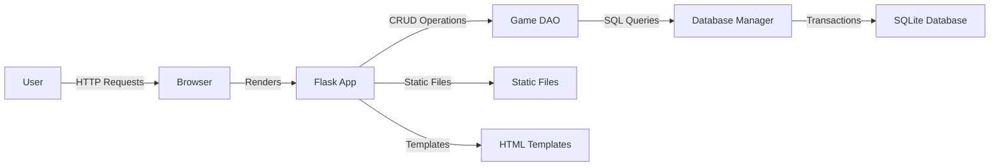

# Game-Shiru (ゲムしる)
## Game Recommendation System

---

# アプリ概要

**Game-Shiru** はゲーム推薦アプリケーションです。

- **目的**: ユーザーがタグ、ジャンル、好みに基づいてゲームを検索・フィルタリング・ソートできる
- **データソース**: 100ゲームのマスターデータを使用
- **主な機能**:
  - タグによる検索
  - 国別フィルタリング
  - リリース日順ソート
  - CRUD操作（ゲームレコードの作成、読み取り、更新、削除）

---

# ペルソナ分析

**ターゲットユーザー**:

1. **ゲーム愛好家**: 新しいゲームを探している
2. **コレクター**: 特定のジャンルやプラットフォームのゲームを収集したい
3. **開発者**: 市場調査や競合分析のためにゲームデータを調べたい
4. **カジュアルプレイヤー**: 自分の好みに合ったゲームを見つけたい

**ユーザーのニーズ**:
- 直感的な検索インターフェース
- 高度なフィルタリングオプション
- 詳細なゲーム情報
- 簡単なデータ管理

---

# システム概要

**3層アーキテクチャ**:

<style scoped>
section {
  font-size: 22px;
}
</style>

1. **ユーザーインターフェース層**
   - Webブラウザ
   - モバイルアプリ

2. **アプリケーション層**
   - Flask Webサーバー
   - ゲームサービス
   - 推薦エンジン
   - 検索サービス

3. **データベース層**
   - SQLiteデータベース
   - 正規化されたスキーマ（第3正規形）
   - トランザクション処理

---

# アプリ構成: フォルダ概要

<style scoped>
section {
  font-size: 22px;
}
</style>


```
game-app/
├── app.py                      # Flaskメインアプリケーション
├── requirements.txt            # Python依存関係
├── README.md                   # プロジェクトドキュメント

├── backend/                    # バックエンドロジック
│   ├── db_manager.py           # データベース接続マネージャー
│   └── game_dao.py             # ゲームデータアクセスオブジェクト

├── db/                         # データベース
│   ├── games.db                # SQLiteデータベース
│   ├── init_db.py              # データベース初期化スクリプト
│   └── schema.sql              # データベーススキーマ

├── data/                       # データファイル
│   └── games.json              # サンプルゲームデータ

├── docs/                       # ドキュメント
│   ├── architecture.pu         # アーキテクチャ図
│   └── schema.pu               # データベーススキーマ図

├── static/                     # 静的ファイル
│   └── style.css               # CSSスタイリング

└── templates/                  # HTMLテンプレート
    ├── base.html               # ベーステンプレート
    ├── index.html              # ホームページ
    ├── detail.html             # ゲーム詳細ページ
    ├── add.html                # ゲーム追加フォーム
    └── edit.html               # ゲーム編集フォーム
```

---

# アプリ構成: 関係図



<style scoped>
section {
  font-size: 22px;
}
</style>


**データフロー**:
1. ユーザーがブラウザで操作
2. Flaskアプリがリクエストを処理
3. Game DAOがデータアクセスを担当
4. Database Managerがトランザクションを管理
5. SQLiteデータベースにデータを保存/取得

---

# DB構成: トランザクション処理

**データベーススキーマ**:
- **正規化**: 第3正規形（3NF）
- **テーブル**: Games, Platforms, Genres, Preferences, Developers
- **リレーション**: 多対多関係のためのジャンクションテーブル

**トランザクション処理**:

<style scoped>
section {
  font-size: 22px;
}
</style>


```python
# DatabaseManagerクラスのトランザクション処理
@contextmanager
def transaction(self) -> Iterator[sqlite3.Cursor]:
    """トランザクションコンテキストマネージャー"""
    conn = self.connect()
    cursor = conn.cursor()
    try:
        yield cursor
        conn.commit()  # 成功時はコミット
    except Exception as e:
        conn.rollback()  # 失敗時はロールバック
        raise e
    finally:
        cursor.close()
```

**主な機能**:
- 自動コミット/ロールバック
- SQLインジェクション防止
- 外部キー制約
- パフォーマンス最適化のためのインデックス

---

# ご清聴ありがとうございました
## Game-Shiruプロジェクトチーム
